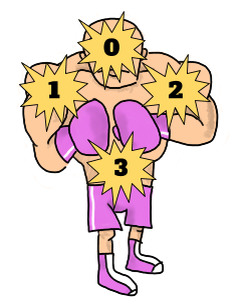

# Boxa entre cavallers

La “boxa entre cavallers” es lleugerament més educada que la tradicional. En aquest tipus de boxa els contendents es claven cops però ho fan de forma ordenada

El combat consisteix en anar repetint el mateix procés:

* Primer pica un mentre l’altre es protegeix
* Després pica el segon mentre el primer es protegeix

El combat acaba quan un dels dos cau perquè ha rebut molts cops en llocs desprotegits

## Cops i protecció

Cada boxejador pot picar en quatre llocs diferents del seu contrincant.

Les proteccions que pot fer un boxejador són perfectes. Això vol dir que si rep un cop en una protecció no rebrà cap mal.

Desafortunadament el que es protegeix només pot protegir tres llocs. Això vol dir que sempre pot rebre un cop en un lloc desprotegit

## Activitat: El combat

Es demana que desenvolupeu, fent servir orientació a objectes, un programa que permeti simular el funcionament del combat de boxa entre cavallers i el vagi radiant per pantalla.

    Ex.
    $ ./boxa
    Combat entre Matxaca i Destrossa
    -------------------------------------
    ...Matxaca pica: Protegit
    ...Destrossa pica: Cop a panxa
    ...Matxaca pica: Cop a cap
    ...Destrossa pica: Protegit
    ...Matxaca pica: Protegit
    ...Destrossa pica: Protegit
    ...Matxaca pica: Protegit
    ...Destrossa pica: Protegit
    ...Matxaca pica: Protegit
    ...Destrossa pica: Protegit
    ...Matxaca pica: Protegit
    ...Destrossa pica: Cop a cap
    ...Matxaca pica: Cop a esquerra
    ...Destrossa pica: Protegit
    ...Matxaca pica: Cop a dreta
    ...Destrossa pica: Protegit
    ...Matxaca pica: Cop a cap
    ...Destrossa pica: Cop a panxa
    ...Matxaca pica: Protegit
    ...Destrossa pica: Protegit
    ...Matxaca pica: Protegit
    ...Destrossa pica: Cop a panxa
    ...Matxaca pica: Cop a esquerra
    ...... Destrossa CAU!
    .
    GUANYADOR: Matxaca
